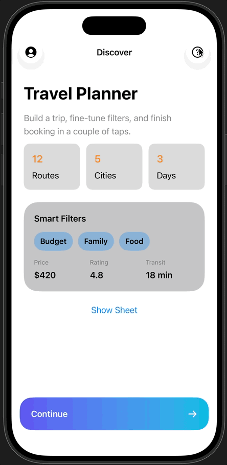

# HelpInfoSpotlightOverlay

Swift package that provides an elegant way to spotlight a SwiftUI view and display help information about it.



## Usage

Define an `enum` to serve as a source of unique ids to tag important views in your UI:

```swift
enum HelpInfo {
case login
case addItem
case deleteItem
case changeName
}
```

Visit your SwiftUI code and tag important entities using the `HelpInfo` tags from above. First, add a small `View` extension to 
allow for `HelpInfo` completions:

```swift
extension View {
  func helpInfoViewTag(_ id: HelpInfo) -> some View { helpInfoViewTag(id: id) }
}
```

Annotate the views with `helpInfoViewTag` using auto-completion of `HelpInfo` values:

```swift
struct AppView: View {
  var body: some View {
    NavigationStack {
      VStack {
        Button("Login") {}
        .helpInfoViewTag(.login)
        Button("Add Item") {}
        .helpInfoViewTag(.addItem)
        Button("Delete Item") {}
        .helpInfoViewTag(.deleteItem)
        Button("Rename") {}
        .helpInfoViewTag(.changeName)
      }
    }
  }
}
```

Now, add a `@State` variable to track the active help info item, and a toolbar button to set this with the first enum case to get
things rolling. Add the `helpInfoSpotlightOverlay` modifier to the top-level view:

```swift
struct DemoAppView: View {
  @State private var selectedHelpInfoItem: HelpInfo?

  var body: some View {
    NavigationStack {
    ...
      .toolbar {
        ToolbarItem(placement: .topBarTrailing) {
          Button("?") { selectedHelpInfoItem = .login }
        }
    }
    .helpInfoSpotlightOverlay(
      selection: $selectedHelpInfoItem, 
      orderedIDs: [HelpInfo.login, .addItem, .deleteItem, .changeName],
      overlay: helpInfoOverlay
    )
  }
}
```

The collection `HelpInfo` enum cases could be simplified by extending `HelpInfo` with `CaseIterable` to make available 
`HelpInfo.allCases`.

See the
[DemoAppView](https://github.com/bradhowes/HelpInfoSpotlightOverlay/blob/c569fa3ec3e9f2ea6b4fc046d93128840114fb2e/Sources/HelpInfoSpotlightOverlay/HelpInfoOverlay.swift#L74)
definition for the finished example. You can also demo it in the Xcode preview for the file.

The last missing piece is to add to `HelpInfo` the `HelpInfoProvider` conformance so that the `helpInfoOverlay` function can 
extract the help text required to show to the user:

```swift
extension HelpInfo: CaseIterable, HelpInfoProvider {
  var title: LocalizedStringKey {
    switch self {
      case .login: return "Login"
      case .addItem: return "Add"
      case .deleteItem: return "Delete"
      case .changeName: return "Rename"
    }
  }
  var text: LocalizedStringKey {
    switch self {
      case .login: return "Touch to log in to the system."
      case .addItem: return "Adds a new item to the collection."
      case .deleteItem: return "Delete the current item from the collection."
      case .changeName: return "Change the name of the current item."
    }
  }
}
```

## Origins

The code in this package derived from that of Artem Mirzabekian and his 
[TutorialSpotlight](https://github.com/Livsy90/TutorialSpotlight) package. However, there were sufficient changes that I created my
own. (the demo page shown above is largely from his source with some adjustments to handle "dark" mode.)

