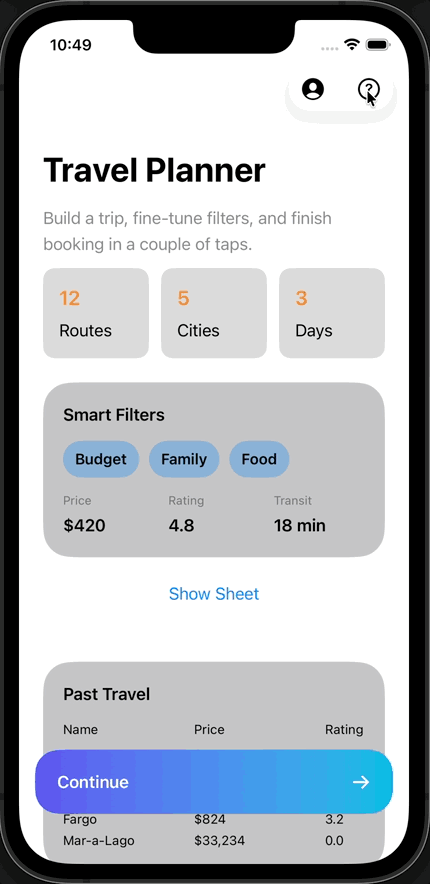
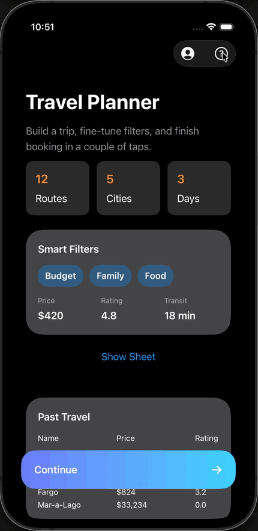

[![][spiv]][spi]
[![][spip]][spi]
[![][mit]][license]

# HelpInfoSpotlightOverlay

Swift package that provides an elegant way to spotlight a SwiftUI view and display help information about it.



## Features

* Supports customized light and dark mode rendering configurations.
* Can "scroll to" a view item to make it visible before showing the help info.
* Allows for customized positioning of the help info overlay and sizing of the spotlight frame.
* Properly renders over sheets.
* Works on macOS (with minor issues).

## Usage Example

Define an `enum` to serve as a source of unique ids to tag important views in your UI:

```swift
enum HelpInfo {
  case login
  case addItem
  case deleteItem
  case changeName
}
```

Visit your SwiftUI code and tag important entities using the `HelpInfo` tags from above. First, add a small `View` extension to 
allow for `HelpInfo` completions:

```swift
extension View {
  func helpInfoViewTag(_ id: HelpInfo) -> some View { helpInfoViewTag(id: id) }
}
```

Annotate the views with `helpInfoViewTag` using auto-completion of `HelpInfo` values:

```swift
struct AppView: View {
  var body: some View {
    NavigationStack {
      VStack {
        Button("Login") {}
        .helpInfoViewTag(.login)
        Button("Add Item") {}
        .helpInfoViewTag(.addItem)
        Button("Delete Item") {}
        .helpInfoViewTag(.deleteItem)
        Button("Rename") {}
        .helpInfoViewTag(.changeName)
      }
    }
  }
}
```

Now, add a `@State` variable to track the active help info item, and a toolbar button to set this with the first enum case to get
things rolling. Add the `helpInfoSpotlightOverlay` modifier to the top-level view:

```swift
struct DemoAppView: View {
  @State private var selectedHelpInfoItem: HelpInfo?

  var body: some View {
    NavigationStack {
    ...
      .toolbar {
        ToolbarItem(placement: .topBarTrailing) {
          Button("?") { selectedHelpInfoItem = .login }
        }
    }
    .helpInfoSpotlightOverlay(
      selection: $selectedHelpInfoItem, 
      orderedIDs: [HelpInfo.login, .addItem, .deleteItem, .changeName],
      generator: helpInfoOverlay
    )
  }
}
```

The collection `HelpInfo` enum cases could be simplified by extending `HelpInfo` with `CaseIterable` to make available 
`HelpInfo.allCases`.

See the [DemoAppView][dav] definition for the finished example. You can also demo it in the Xcode preview for the file.

The last missing piece is to add to `HelpInfo` the `HelpInfoProvider` conformance so that the `helpInfoOverlay` function can 
extract the help text required to show to the user:

```swift
extension HelpInfo: CaseIterable, HelpInfoProvider {
  var title: LocalizedStringKey {
    switch self {
      case .login: return "Login"
      case .addItem: return "Add"
      case .deleteItem: return "Delete"
      case .changeName: return "Rename"
    }
  }
  var text: LocalizedStringKey {
    switch self {
      case .login: return "Touch to log in to the system."
      case .addItem: return "Adds a new item to the collection."
      case .deleteItem: return "Delete the current item from the collection."
      case .changeName: return "Change the name of the current item."
    }
  }
}
```

This is only necessary when using the built-in `helpInfoOverlay`.

## Configuration

The `helpInfoSpotlightOverlay` view modifier requires three values, but it accepts addional, optional ones to customize the
behavior and appearance of the spotlight and the help info overlays.

```
public func helpInfoSpotlightOverlay<ID: Hashable, Overlay: View>(
  selection: Binding<ID?>,
  orderedIDs: [ID] = [],
  viewConfig: HelpInfoOverlayViewConfig = .init(),
  generator: @escaping (_ id: ID, _ actions: HelpInfoSpotlightOverlayActions) -> Overlay,
  placer: HelpInfoOverlayConfig<ID, Overlay>.Placer? = nil,
  framer: HelpInfoOverlayConfig<ID, Overlay>.Framer? = nil
) -> some View where ID: HelpInfoProvider {
```

The `placer` function can be used to handle where the help info overlay view will appear. The default behavior is for it to
appear centered and below the spotlight frame or above it depending on what space is available in the container.

The `framer` function can be used to adjust the spotlight frame that is drawn around the view item. The default behavior
is to expand the frame by `spotlightPadding` and to add a corner radius per the values in the `viewConfig`.

The `viewConfig` allows for customization of the appearance of theoverlay views. It contains the following attributes
the (defaults given in parentheses):

* `spotlightPadding` -- padding to the spotlight region to make it larger (positive) or smaller (negative). (8)
* `cornerRadius` -- a corner radius to apply to the spotlight area rectangle. (28)
* `blurRadius` -- the amount of blurring to apply to the edge of the spotlight. (6)
* `horizonalPadding` -- padding to the leading and trailing edges of the help info overlay (16)
* `verticalPadding` -- padding to the top and bottom edges of the help info overlay (24)
* `verticalSeparation` -- desired separation between the spotlight region and the help info overlay view (24)
* `animationDuration` -- the duration of the animations used by the views. (0.65)
* `lightModeDimmingOpacity` -- opacity of the masking overlay that covers the root view, minus the spotlight region. (0.7)
* `lightModeMaskColor` -- color of the masking overlay view (`.black`)
* `darkModeDimmingOpacity` -- opacity of the masking overlay that covers the root view, minus the spotlight region. (0.8)
* `darkModeMaskColor` -- color of the masking overlay view (a sepia tone)
* `scrollToItem` -- when `true`, attempts to make visible the view to spotlight. (true)
* `windowedMode` -- controls if the overlays are in a custom UIWindow for better rendering (`.useCustomWindow`)
view hiearchy attached to the view modifier.

The `scrollToItem` is done by wrapping the main view in a `ScrollViewReader` and then calling `scrollTo` with the ID of the 
view to highlight. This seems to work OK, but it can be disabled if the use of the `ScrollViewReader` is causing issues with 
your SwiftUI code.

## Origins

The code in this package derived from code in the [TutorialSpotlight][ts] package by Artem Mirzabekian. However, there
were sufficient changes that I created my own. (the demo page shown above is largely from his source with some
adjustments to handle "dark" mode and to show off the `scrollTo` functionality.)

## Alternatives

Besides the [TutorialSpotlight][ts] mentioned above, another nice alternative is [Beacon][beacon]. It offers a way to actually drive
a guided tour of your app's features without too much effort. I studied how it creates and manages a top-level UI window, and I 
implemented something similar that worked with what I already working as a view modifier.

[spi]: https://swiftpackageindex.com/bradhowes/HelpInfoSpotlightOverlay
[spiv]: https://img.shields.io/endpoint?url=https%3A%2F%2Fswiftpackageindex.com%2Fapi%2Fpackages%2Fbradhowes%2FHelpInfoSpotlightOverlay%2Fbadge%3Ftype%3Dswift-versions
[spip]: https://img.shields.io/endpoint?url=https%3A%2F%2Fswiftpackageindex.com%2Fapi%2Fpackages%2Fbradhowes%2FHelpInfoSpotlightOverlay%2Fbadge%3Ftype%3Dplatforms
[mit]: https://img.shields.io/badge/License-MIT-A31F34.svg
[license]: https://opensource.org/licenses/MIT
[ts]: https://github.com/Livsy90/TutorialSpotlight
[beacon]: https://github.com/mmellau/swift-beacon
[dav]: https://github.com/bradhowes/HelpInfoSpotlightOverlay/blob/c569fa3ec3e9f2ea6b4fc046d93128840114fb2e/Sources/HelpInfoSpotlightOverlay/HelpInfoOverlay.swift#L74
